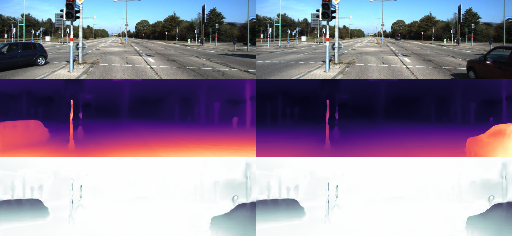
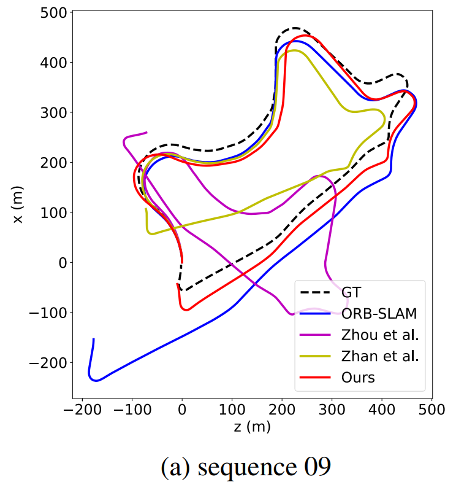

# SC-SfMLearner

This codebase implements the system described in the paper:

Unsupervised Scale-consistent Depth and Ego-motion Learning from Monocular Video

[Jia-Wang Bian](https://jwbian.net/), Zhichao Li, Naiyan Wang, Huangying Zhan, Chunhua Shen, Ming-Ming Cheng, Ian Reid

**NeurIPS** 2019 


See the paper on [[arXiv](https://arxiv.org/abs/1908.10553)] and the [[project webpage](https://jwbian.net/sc-sfmlearner/)] for more details. 




## Highlighted Features
  1. A geometry consistency loss for enforcing the scale-consistency of predictions between consecutive frames.
  2. A self-discovered mask for detecting moving objects and occlusions.
  3. Enabling the unsupervised estimator (learned from monocular videos) to do visual odometry on a long video.


## Preamble
This codebase was developed and tested with python 3.6, Pytorch 1.0.1, and CUDA 10.0 on Ubuntu 16.04.
It is based on [Clement Pinard's SfMLearner implementation](https://github.com/ClementPinard/SfmLearner-Pytorch),
in which we make little modification and add our proposed losses.


## Prerequisite

```bash
pip3 install -r requirements.txt
```

or install manually the following packages :

```
torch >= 1.0.1
imageio
matplotlib
scipy
argparse
tensorboardX
blessings
progressbar2
path.py
evo
```

It is also advised to have python3 bindings for opencv for tensorboard visualizations


## Preparing training data

See "scripts/run_prepare_data.sh" for examples, including KITTI Raw, Cityscapes, and KITTI Odometry.

For [KITTI Raw dataset](http://www.cvlibs.net/datasets/kitti/raw_data.php), download the dataset using this [script](http://www.cvlibs.net/download.php?file=raw_data_downloader.zip) provided on the official website.

For [Cityscapes](https://www.cityscapes-dataset.com/), download the following packages: 1) `leftImg8bit_sequence_trainvaltest.zip`, 2) `camera_trainvaltest.zip`. You will probably need to contact the administrators to be able to get it. 

For [KITTI Odometry dataset](http://www.cvlibs.net/datasets/kitti/eval_odometry.php) download the dataset with color images.


## Training

The "scripts" folder provides several examples for training and testing.

You can train the depth model on KITTI Raw by running
```bash
sh scripts/train_resnet_256.sh
```
or train the pose model on KITTI Odometry by running
```bash
sh scripts/train_posenet_256.sh
```
Then you can start a `tensorboard` session in this folder by
```bash
tensorboard --logdir=checkpoints/
```
and visualize the training progress by opening [https://localhost:6006](https://localhost:6006) on your browser. 


## Evaluation

You can evaluate depth using Eigen's split by running
```bash
sh scripts/run_depth_test.sh
```
and evaluate visual odometry by running
```bash
sh scripts/run_vo_test.sh
```
Also, you can evaluate 5-frame pose as SfMLearner by running
```bash
sh scripts/run_pose_test.sh
```


## Pretrained Models

[Avalaible here](https://1drv.ms/u/s!AiV6XqkxJHE2g2LA8enHaQQOg0jZ?e=FNbH3c)

Note that depth models are trained on KITTI Raw dataset, and pose models are trained on KITTI Odometry dataset, respectively.
They are not coupled.


### Depth Results (KITTI Eigen's splits)

|   Models   | Abs Rel | Sq Rel | RMSE  | RMSE(log) | Acc.1 | Acc.2 | Acc.3 |
|------------|---------|--------|-------|-----------|-------|-------|-------|
| k_depth    | 0.137   | 1.089  | 5.439 | 0.217     | 0.830 | 0.942 | 0.975 |
| cs+k_depth | 0.128   | 1.047  | 5.234 | 0.208     | 0.846 | 0.947 | 0.976 |

### Visual Odometry Results (Train on KITTI 00-08)

|   Models   |                     | Seq. 09 | Seq. 10 |
|------------|---------------------|---------|---------|
|   k_pose   |t_err (%)            | 11.2    | 10.1    |
|            |r_err (degree/100m)  | 3.35    | 4.96    | 
|  cs+k_pose |t_err (%)            | 8.24    | 10.7    |
|            |r_err (degree/100m)  | 2.19    | 4.58    | 




 ## If you use this work, please cite our paper
 
    @inproceedings{bian2019depth,
      title={Unsupervised Scale-consistent Depth and Ego-motion Learning from Monocular Video},
      author={Bian, Jia-Wang and Li, Zhichao and Wang, Naiyan and Zhan, Huangying and Shen, Chunhua and Cheng, Ming-Ming and Reid, Ian},
      booktitle= {Thirty-third Conference on Neural Information Processing Systems (NeurIPS)},
      year={2019}
    }

    


